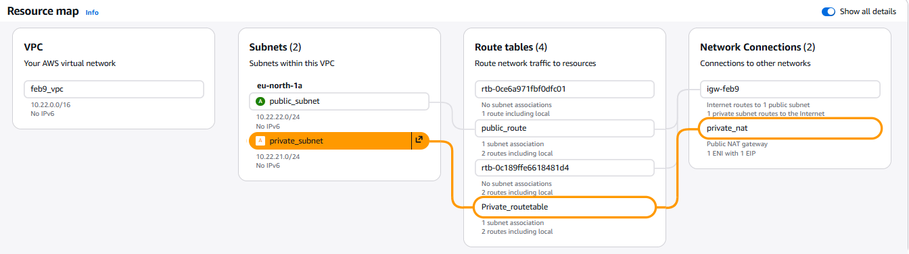

# AWS Secure Two-Tier Web Architecture

## Project Objective
To design and deploy a highly secure web environment using a **Public/Private Subnet** strategy. This ensures the web server is isolated from the public internet, accessible only through a controlled **Bastion Host**.

## Architecture Components
* **VPC:** Custom VPC (10.0.0.0/16)
* **Public Subnet:** Hosts the Bastion Host (Jump Server) with Internet Gateway access.
* **Private Subnet:** Hosts the Apache Web Server (No Public IP).
* **NAT Gateway:** Allows the Private Instance to download updates without being exposed to inbound traffic.
* **Security Groups:** * **Bastion:** Allows SSH (22) from My IP.
    * **Web Server:** Allows HTTP (80) and SSH (22) only from the Bastion Security Group.

    

## Deployment and Proof of Work
Since this server is hosted in a private subnet, it is not accessible via a public URL. Access is verified via **SSH Tunneling** from the Bastion Host to the Private IP.

## Security Best Practices Implemented
* **Least Privilege:** Web server only accepts traffic from the Bastion.
* **Isolation:** No Public IP assigned to the application server.
* **Secure Management:** Using SSH Key Pairs for all transitions.
